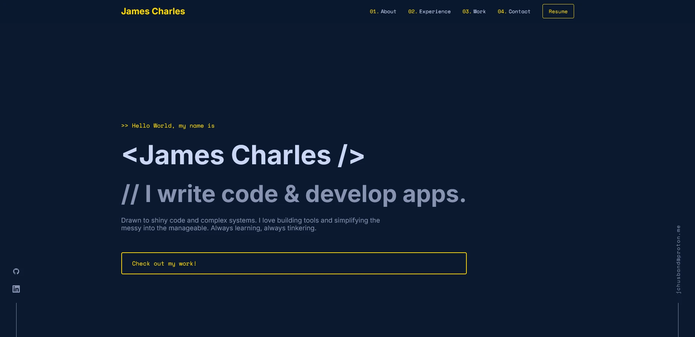

# Personal Development Portfolio

<p align="center">
    
</p>

Portfolio website built with Next.js 14 and TypeScript, showcasing my development projects and professional experience.


## 🛠️ Built With

- [Next.js 14](https://nextjs.org/)

## 📥 Getting Started

1. Clone the repository:

   ```bash
   git clone https://github.com/jameshusband/portfolio.git
   ```

2. Install dependencies:

   ```bash
   npm install
   ```

3. Run the development server:

   ```bash
   npm run dev
   ```

4. Open [http://localhost:3000](http://localhost:3000) in your browser

## 📄 License

This project is open source and available under the [MIT License](LICENSE).
